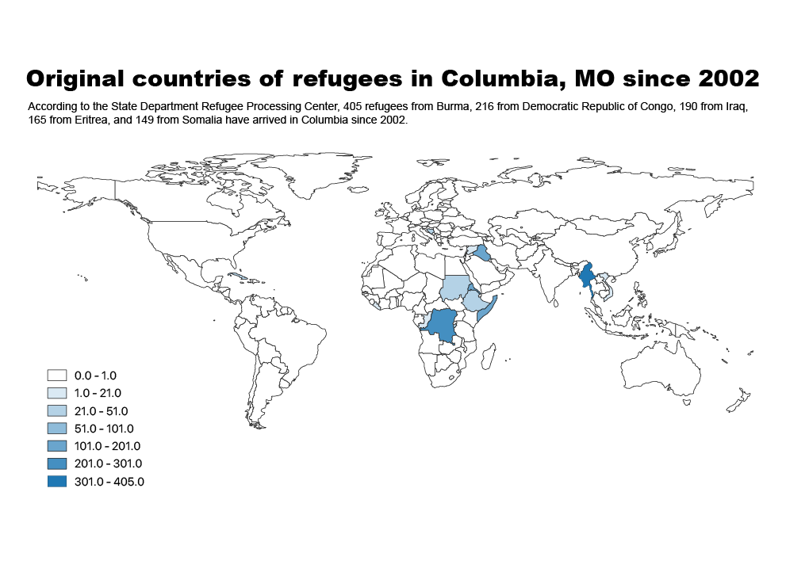

#Low number of refugee arrivals continue in FY 2018

Columbia is doing better than the nation at meetings its refugee goals in terms of how many refugees it has received in the first half year of fiscal 2018.

As of March 31, the U.S. has received 10,548 refugees, according to the data released by the State Department Refugee Processing Center. This is less than a quarter of the total of 45,000 refugees it planned to take in for fiscal year 2018 beginning from October 1, 2017.

Dan Lester, the Executive Director of Catholic Charities of Central and Northern Missouri, said that Columbia is projected to receive about 120 refugees this fiscal year. Around 50 of them have arrived by the end of March.

However, Lester said in the wake of President Trump’s recent travel ban, the number of refugees arrived was significantly decreased compared to previous years.

```{r echo=FALSE}
library (ggplot2)
library (ggthemes)
library (scales)
library(reshape2)

df <- read.csv('ceiling.csv',fileEncoding = "UTF-8-BOM",stringsAsFactors = FALSE)
dfl <- melt(df, id.vars='YEAR')
colnames(dfl) <- c('year','type','number')
ggplot(dfl, aes(x=factor(year), y=number,fill=type))+
  geom_bar(position='dodge', stat='identity',width=0.8)+
  theme_economist()
```

The Catholic Charities managed the refugee resettlement program by receiving federal grants each year based on the number of refugees it receives.

 “We supplement the program somewhat through private fundraising and private donations, but for the most part the majority of its funding source is government grant funding,” Lester said.

Yet with limited funding, the program is unable to do as much as it wanted to do.

In January of 2017, President Trump signed an executive order, known as the travel ban, which suspended U.S. Refugee Admission Program for 120 days and slashed the refugee arrival ceiling by more than half from 110,000 to 50,000, which was originally set by Barack Obama.

During the Obama Administration, incoming refugees were capped at about 85,000 every year. However, after Trump took office, he downsized that number to a record low of 45,000.

The local impact is obvious. Columbia received more than 200 refugees in 2016 but only 122 last year. As for this year, Lester said he didn’t expect the overall number to go up anytime soon.

```{r echo = FALSE}
df <- read.csv('CO.csv')
duplicated(df$total_city)
dftotal_city <- df[!duplicated(df$total_city),]
ggplot(dftotal_city)+
  geom_bar(stat='identity',aes(x = FY,y = total_city), width = 0.8)+
  scale_x_discrete(
    labels=c('2002','2003','2004','2006','2007','2008','2009','2010','2011','2012','2013','2014','2015','2016','2017','2018')
                   )+
  scale_y_continuous(breaks=seq(0,250,50))+
  labs(
    x=' ',
    y='Refugees arrived in Columbia',
    title='Columbia Refugee arrivals plummeted again in 2018',
    subtitle='After a booming in refugee arrival in 2016, the number of refugee settled in Columbia dropped\ndramatically in 2017, and the downward trend continues in 2018. '
  )+
  theme_economist()
```

Somalis are among the most affected refugees seeking asylum in Columbia. “This year we haven’t got anyone from Somalia, and that used to be one of the bigger population we resettled,” the organization’s community outreach coordinator Alex Ringling said.

According to the State Department Refugee Processing Center, 409 refugees from Burma, 231 from Democratic Republic of Congo, 190 from Iraq, 173 from Eritrea, and 149 from Somalia have arrived in Columbia since 2002.



For people from African countries, they are more likely to face racism on top of cultural differences and language barriers. But for Somalis, their religion makes it even harder for them to find a home in the United States.

Both 2002 and 2003 saw a sharp decrease in the number of admissions due to the fear of terrorism after the attacks of Sept. 11, and that fear was reflected in the work with refugees. “Unfortunately, a lot of folks we resettle come from predominantly Muslim countries. You end up getting some negative backlash.” Lester said.

“But then things stabilize,” he said, “And then you get changes in the administration.”

Currently there are less than 60 Somalis living in Columbia. Ringling said they resettled more but many Somalis moved to Kansas City and Minneapolis where there is a bigger Somali population, more East African restaurants and cultural presence. 

“For the Somalis, there’s just no place in Columbia where they can collectively come together and see their culture,” Ringling said. 

Over the last decade, the refugee program run by Catholic Charities of Central and Northern Missouri has helped more than 1,400 refugees from 15 countries. Every year, they help an average number of 150 people resettle in Columbia.

But under a tight budget, Ringling said they lost some of their staff and many people that stayed had to be registered as part-time for a period of time. 

“It just means folks may not be able to spend as much time focused on what they might to be focusing on as possible,” Lester said. “It adds to the workload of everybody on the long run.”

According to a previous Reuter’s report, a quarter of the refugee resettlement agencies have been closed nationwide, including one in Kansas City. On one hand, the shortage of money is a common reason for the closure or merging of refugee agencies; on the other hand, lack of arrival means there is less work, especially in big urban cities where two or more refugee programs provide the same kind of services.

As the only resettlement program in mid-Missouri, Lester said they were fortunate due to their geographic isolation. “That has been a bit of benefit for us when we are thinking of whether we are able to continue this work,” he said.

!(resettlementagenciesmap.png)

Columbia is a hub in terms of resettlement work in mid-Missouri.

When it comes to resettlement, the federal government takes into consideration the diversity of placement settings as well as the particular needs of incoming refugees. 

Ringling said half of the refugees they helped are children coming with their families. Therefore, the rich education and healthcare resources Columbia as a college town provides have great appeal to the refugees.

The university also plays an essential role in stabilizing the local economy and converging international population. “The diversity that the university brings to mid-Missouri really helps make resettlement possible,” Lester said.

However, Ringling said even though the resources were out there, it was really hard for refugees to access them. 

The program’s goal is to assists refugees to live independently in Columbia, helping the refugees become financially self-sufficiency because the program is only allowed to offer living expenses for refugees in the first three months upon their arrivals.

“We all have multiple job positions, and it’s a lot of work,” Ringling said. “As much as I care, we can’t take everybody to work every day and translate for everybody all the time.” 

The refugee resettlement program also provides home services, translation services, and connections to local resources. For example, the program is cooperating with Parents As Teachers program at the Columbia Public Schools to help with refugee families with their children.

At the same time, she also called for local community efforts. “It’s a community-wide thing,” she said. “I think Columbia will be so much more interesting if the immigrants that live here are reflected in the community.”

People sympathize refugees and may donate goods, but there are still a lot of barriers to resettlement. “What we need is people to be involved, paying attention and willing to actually know refugees,” she said. “You can’t help what you don’t know.”